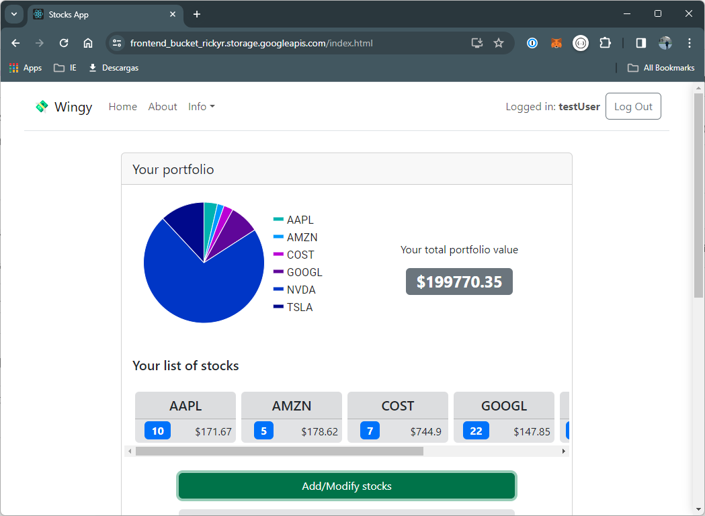
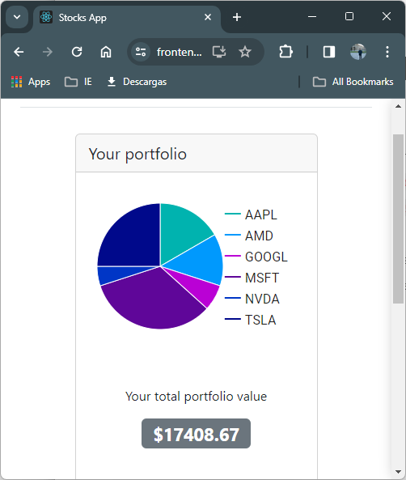

# README

Here you will find some notes for the different milestones of the Capstone project from the second term of the MCSBT. Enjoy.

## Milestone 3

In order to access the app use: username: `testUser` , password: `12345`

The app is accessible through this [link](https://frontend_bucket_rickyr.storage.googleapis.com/index.html).

You can find the Flask server code [here](https://github.com/ricardorompar/capstoneT2/tree/main/stocks_server).

New features:

- Persistent session for user logged in. Session is controlled via server cookies.
- Graph for past values

The add/modify stock is a single tool that allows the user to modify their portfolio. In order to use it you must specify a stock ticker and the quantity and if you put a symbol that doesn’t belong to your portfolio it adds the new stock and if you put quantity=0 to an existing symbol it will delete it. Otherwise modify the amount of stocks that the user has.

Here are some screenshots of the new version:

There is no registration feature, however there are two registered users. If anyone's reading while the app is still alive and you need a personalized user, contact me.

---

## Milestone 2

In order to access the app use:

- Username: `testUser`
- Password: `12345`

The app is available in the same [link](https://frontend_bucket_rickyr.storage.googleapis.com/index.html).

The system now has connection to an Oracle database.

---

## Milestone1

The main differences from the previous version are:

- The app is now available online. Can be accessed through [this link](https://frontend_bucket_rickyr.storage.googleapis.com/index.html).
- The main page displays the total portfolio value
- The app offers a basic navigation experience. Compared to the previous version, the stock list is now included in a navbar that pops from the left and the relevant past values are displayed as a table in the center of the page.

Stay tuned for DB integration next week!

---

## Milestone0

In this milestone the basic implementation of the app was made.

### Basic functionality

The system has two parts:

- Frontend: is an app that can make requests to the server. In this project, I developed a basic interface using React. In the “landing page” there is a component called StocksList that makes all the requests to the server:
    - GET `/api/portfolio` displays the list of stocks belonging to the user portfolio and the corresponding latest closing value
    - GET `/api/portfolio/symbol` displays the list of values from the last 30 days for the specified `symbol`
- Server: replies with a JSON containing the requested information. In each case:
    - GET `/api/portfolio` the server replies a JSON with key value pairs in the format “SYMBOL: LCV”, meaning the latest closing values
    - GET `/api/portfolio/symbol` server replies a JSON with the requested symbol and the values high, low, open, close and volume from the last 30 days

In each case, the server performs another HTTP request to the AlphaVantage API. It processes that information and returns only the closing value or the values from the last 30 days accordingly.

The component in the center is the StocksList which does all the requests to the Flask server

When the user clicks on a stock name the app displays the values from the last 30 days:

The navbar and footer are just decorations for the moment. They don’t really provide any functionality.

### Authentication

For Milestone0, user authentication is not yet implemented. The different users must be selected by hard coding it in the server app.

There are 3 different portfolios corresponding to user{n} in the [user_database.json](https://github.com/ricardorompar/capstoneT2/blob/main/milestones/user_database.json) file.

Update from March 6, 2024 : authentication will be implemented in upcoming milestones.

---